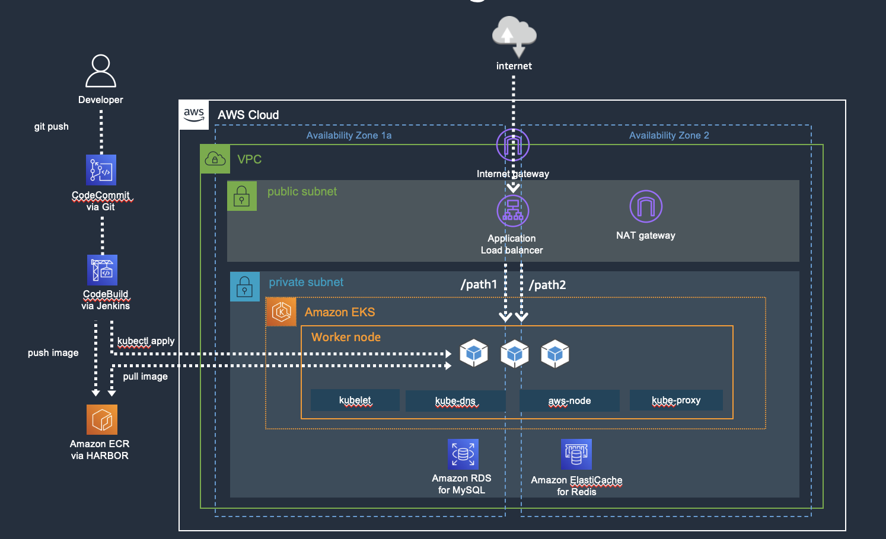

# Deploying Microservice to Amazon EKS Fargate

## Components

- Amazon VPC
- Amazon EKS/ECR
- Amazon CodeCommit/CodeBuild/CodePipeline
- Amazon RDS/Elasticache

## Architecture



## Install

```
$ cdk deploy
```


